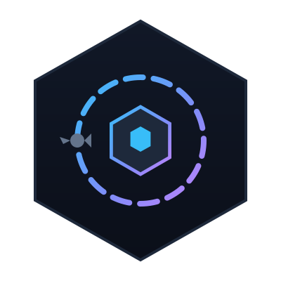

<!-- Improved compatibility of back to top link: See: https://github.com/othneildrew/Best-README-Template/pull/73 -->
<a id="readme-top"></a>

<!-- PROJECT SHIELDS -->
[![License][license-shield]][license-url]
[![Tech][tech-shield]][tech-url]
[![Runtime][runtime-shield]][runtime-url]

<br />
<div align="center">
  <a href="https://github.com/remiboivin021/crewgate">
    
  </a>

<h3 align="center">CrewGate</h3>

  <p align="center">
    Multi-agent pipeline orchestrator for OpenCode
    <br />
    <a href="./docs/index.md"><strong>Explore the docs »</strong></a>
    <br />
    <br />
    <a href="#">View Demo</a>
    &middot;
    <a href="https://github.com/remiboivin021/crewgate/issues/new?template=bug_report.yml&labels=bug">Report Bug</a>
    &middot;
    <a href="https://github.com/remiboivin021/crewgate/issues/new?template=feature_request.yml&labels=enhancement">Request Feature</a>
  </p>
</div>

<!-- TABLE OF CONTENTS -->
<details>
  <summary>Table of Contents</summary>
  <ol>
    <li>
      <a href="#about-the-project">About The Project</a>
      <ul>
        <li><a href="#built-with">Built With</a></li>
      </ul>
    </li>
    <li>
      <a href="#getting-started">Getting Started</a>
      <ul>
        <li><a href="#prerequisites">Prerequisites</a></li>
        <li><a href="#installation">Installation</a></li>
      </ul>
    </li>
    <li><a href="#contributing">Contributing</a></li>
    <li><a href="#license">License</a></li>
    <li><a href="#contact">Contact</a></li>
  </ol>
</details>

<!-- ABOUT THE PROJECT -->
## About The Project

CrewGate is a multi-agent pipeline orchestrator for OpenCode — currently in early development.

This repository contains the project foundation:

- **Architecture documentation** — System overview, assumptions, boundaries, interfaces, C4 diagrams
- **Governance** — Decision framework, ADR templates, checklists

### Built With

* [![TypeScript][TypeScript]][TypeScript-url]
* [![Bun][Bun]][Bun-url]

<p align="right">(<a href="#readme-top">back to top</a>)</p>

<!-- GETTING STARTED -->
## Getting Started

### Prerequisites
#### Bun

```sh
npm install -g bun@1.3.x
```

### Installation

```sh
bun install
```

<p align="right">(<a href="#readme-top">back to top</a>)</p>


## Contributing

Contributions are what make the open source community such an amazing place to learn, inspire, and create. Any contributions you make are **greatly appreciated**.

If you have a suggestion that would make this better, please fork the repo and create a pull request. You can also simply open an issue with the tag "enhancement".
Don't forget to give the project a star! Thanks again!

1. Fork the Project
2. Create your Feature Branch (`git checkout -b feature/AmazingFeature`)
3. Commit your Changes (`git commit -m 'Add some AmazingFeature'`)
4. Push to the Branch (`git push origin feature/AmazingFeature`)
5. Open a Pull Request

See [`CONTRIBUTING.md`](./CONTRIBUTING.md) for more information.

<p align="right">(<a href="#readme-top">back to top</a>)</p>

## License

Distributed under the MIT License. See [`LICENSE`](./LICENSE) for more information.

<p align="right">(<a href="#readme-top">back to top</a>)</p>

## Contact

Rémi Boivin - [@Rémi Boivin](https://www.linkedin.com/in/remi-boivin-embedded-engineer/) - remiboivin021@gmail.com

Project Link: [https://github.com/remiboivin021/crewgate](https://github.com/remiboivin021/crewgate)

<p align="right">(<a href="#readme-top">back to top</a>)</p>


<!-- MARKDOWN LINKS & IMAGES -->
[license-shield]: https://img.shields.io/github/license/remiboivin021/crewgate.svg?style=for-the-badge
[license-url]: https://github.com/remiboivin021/crewgate/blob/main/LICENSE
[tech-shield]: https://img.shields.io/badge/TypeScript-3178C6?style=for-the-badge&logo=typescript&logoColor=white
[tech-url]: https://www.typescriptlang.org/
[runtime-shield]: https://img.shields.io/badge/Bun-000000?style=for-the-badge&logo=bun&logoColor=white
[runtime-url]: https://bun.sh/
[TypeScript]: https://img.shields.io/badge/TypeScript-3178C6?style=for-the-badge&logo=typescript&logoColor=white
[TypeScript-url]: https://www.typescriptlang.org/
[Bun]: https://img.shields.io/badge/Bun-000000?style=for-the-badge&logo=bun&logoColor=white
[Bun-url]: https://bun.sh/
