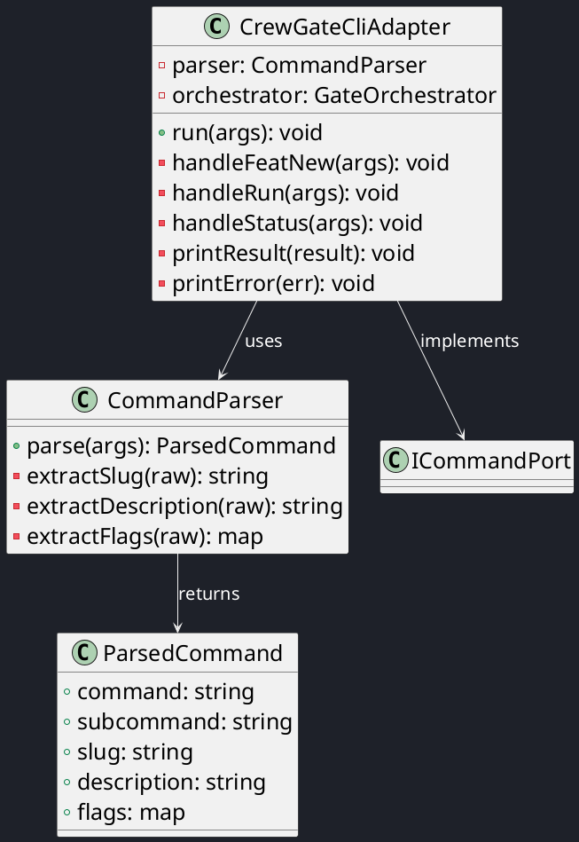
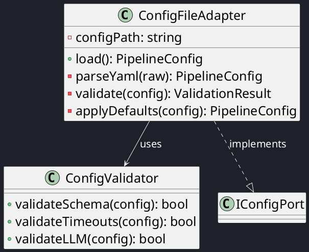
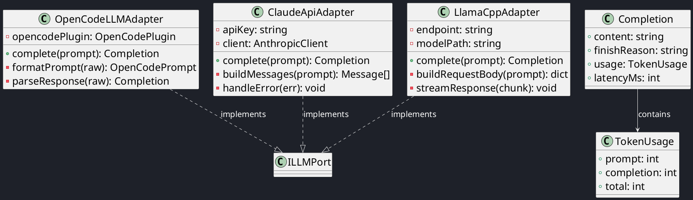
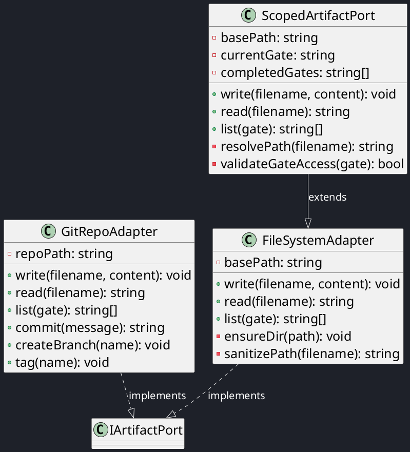
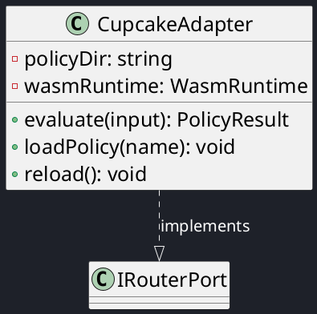

# C4 Code View — Adapter Implementations

This document provides a code-level decomposition of the CrewGate adapter layer. Adapters implement port interfaces and bridge the domain layer with external systems.

## CLI Adapter (Inbound)

## Config Adapter (Inbound)

## LLM Adapters (Outbound)

## Filesystem & Git Adapters (Outbound)

## Router Adapter (Outbound)

---

| Author      | Last modified |
|-------------|---------------|
| Rémi Boivin | 2026-05-21    |