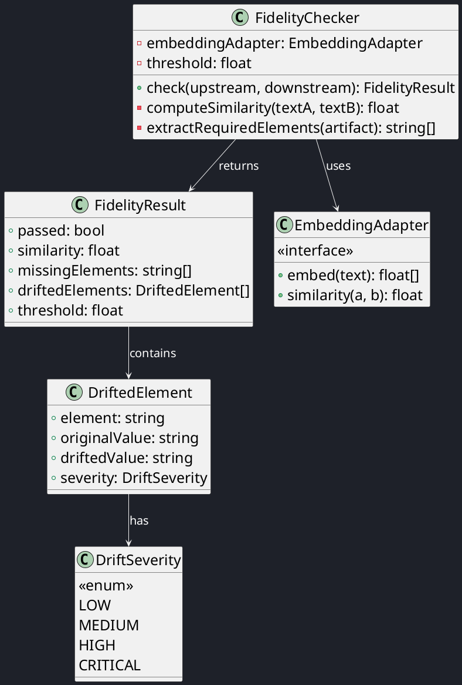
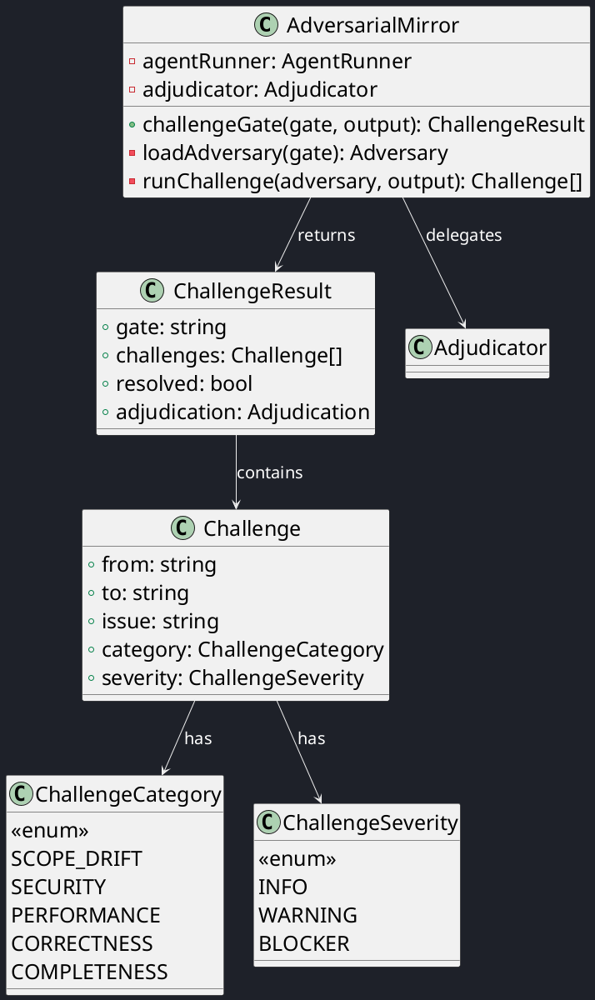
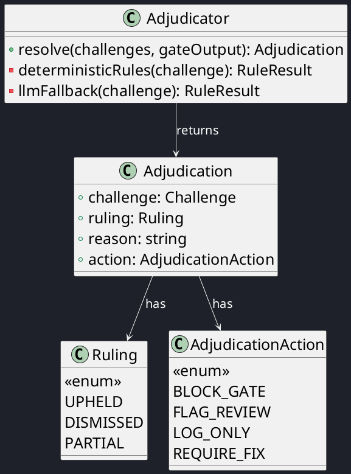
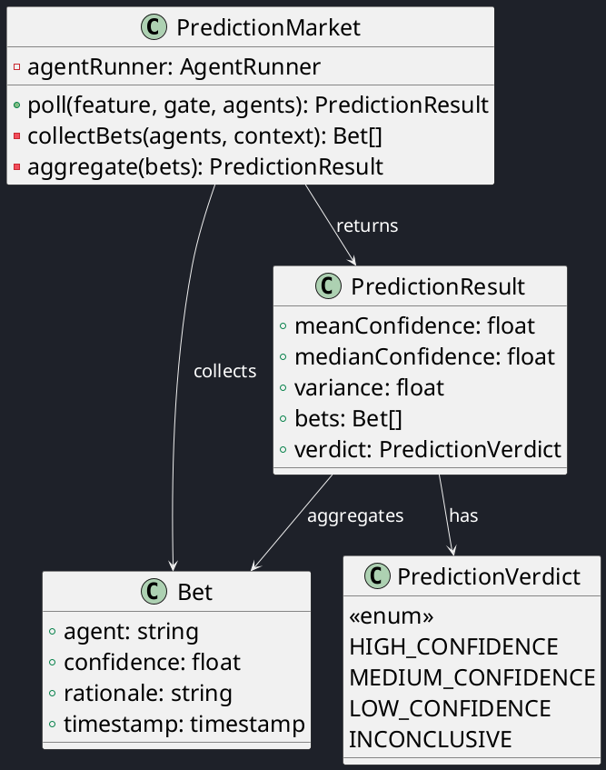

# C4 Code View — Cross-Cutting Mechanisms

This document provides a code-level decomposition of the CrewGate cross-cutting mechanisms.

| Mechanism | Version | Status |
|-----------|:-------:|:------:|
| Fidelity Checker | v0.2 | planned |
| Adversarial Mirror | v0.2 | planned |
| Adjudicator | v0.2 | planned |
| Prediction Market | v0.2 | planned |

## Fidelity Checker (v0.2)

## Adversarial Mirror (v0.2)

## Adjudicator (v0.2)

## Prediction Market (v0.2)

---

| Author      | Last modified |
|-------------|---------------|
| Rémi Boivin | 2026-05-21    |