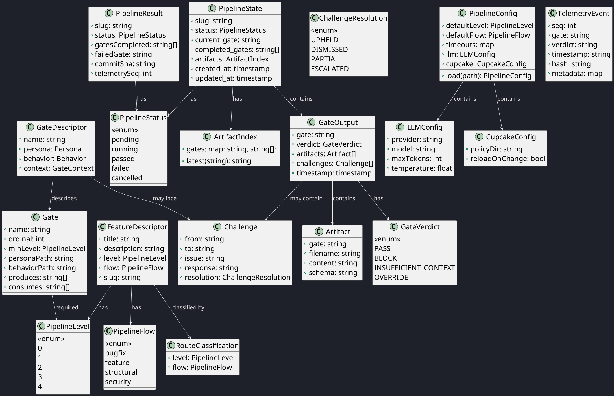

# C4 Code View — Domain Model (Core Entities)

This document provides a code-level decomposition of the CrewGate domain model.

## Core Entities



## CLI Entry / Exit Contracts
Formats de la CLI. L'**entrée** est une commande shell ; la **sortie** est un JSON écrit sur stdout.

### Commandes CLI (entrée)

```
crewegate feat new "<title>: <description>"
crewegate run <slug>
crewegate status [slug]
crewegate resume <slug>
crewegate cancel <slug>
crewegate rollback <slug>
crewegate log [slug]
```

### Sorties JSON (stdout)
**Succès** — tous les gates ont passé :

```json
{
  "slug": "ma-feature",
  "status": "passed",
  "gates_completed": ["preflight", "developer", "qa", "review"],
  "commit_sha": "a1b2c3d",
  "telemetry_seq": 42
}
```

**Échec** — un gate a bloqué :

```json
{
  "slug": "ma-feature",
  "status": "failed",
  "failed_gate": "qa",
  "reason": "Fidelity check threshold not met",
  "resumable": true
}
```

---

| Author      | Last modified |
|-------------|---------------|
| Rémi Boivin | 2026-05-21    |