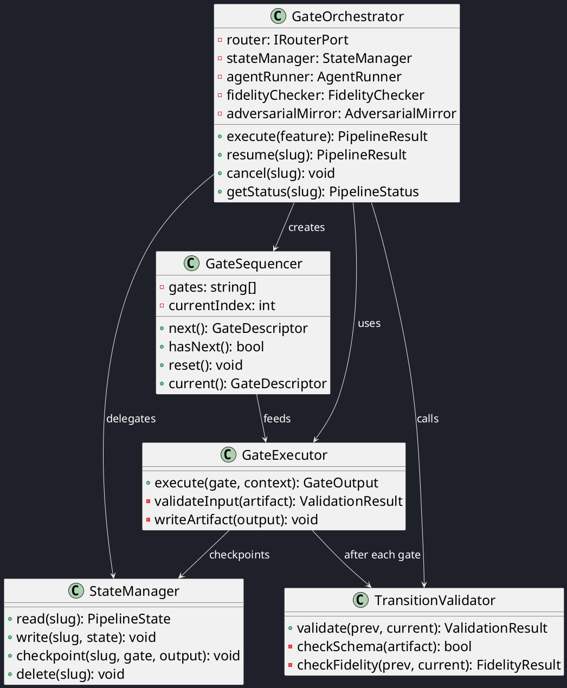
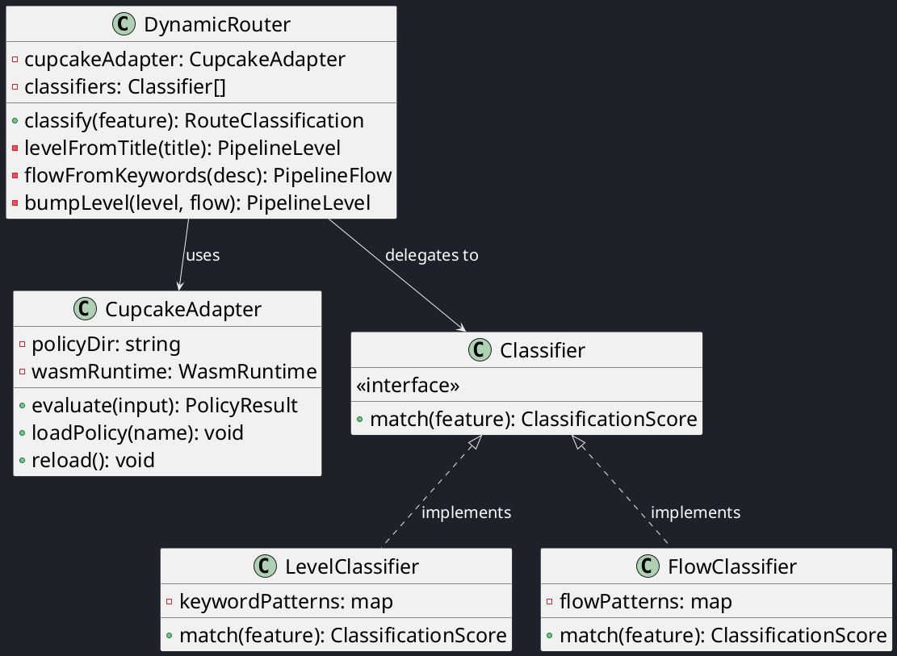
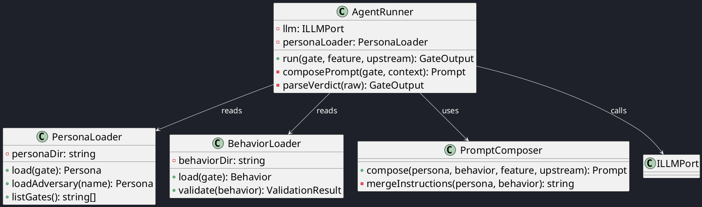

# C4 Code View — Orchestrator & Router

This document provides a code-level decomposition of the Gate Orchestrator, Dynamic Router, and Agent Runner.

## Gate Orchestrator

## Dynamic Router

## Agent Runner

---

| Author      | Last modified |
|-------------|---------------|
| Rémi Boivin | 2026-05-21    |