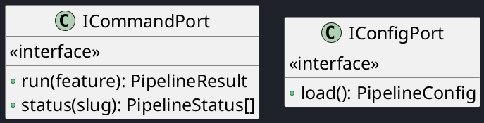
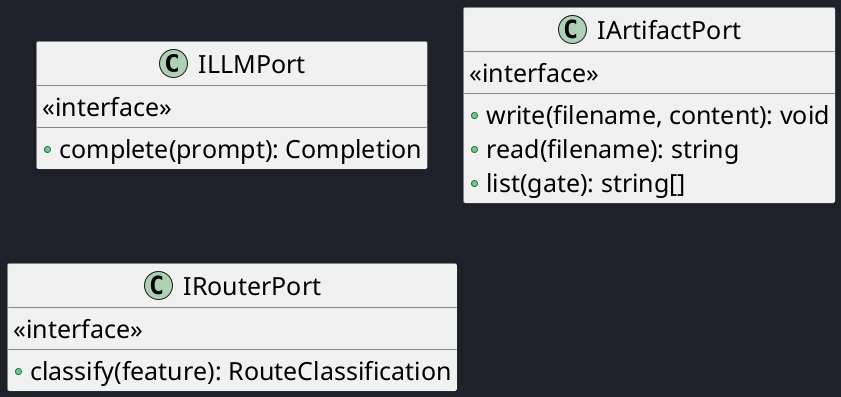

# C4 Code View — Port Interfaces

This document provides a code-level decomposition of the CrewGate hexagonal port interfaces.

## Inbound Ports (v0.1)

## Outbound Ports (v0.1)

## Port Relationships (v0.1)

```plantuml
@startuml
skinparam backgroundColor #1e2129
skinparam defaultFontSize 25
skinparam rectanglePadding 20
skinparam arrowFontSize 20
skinparam arrowFontColor #FFFFFF
skinparam arrowColor #EEEEEE

    class DomainLayer {
        <<boundary>>
    }

    class CLIAdapter {
        +implements ICommandPort
    }

    class ConfigFileAdapter {
        +implements IConfigPort
    }

    class OpenCodeLLMAdapter {
        +implements ILLMPort
    }

    class FileSystemAdapter {
        +implements IArtifactPort
    }

    class CupcakeAdapter {
        +implements IRouterPort
    }

    class ClaudeApiAdapter {
        +implements ILLMPort
    }

    class LlamaCppAdapter {
        +implements ILLMPort
    }

    class GitRepoAdapter {
        +implements IArtifactPort
    }

    class ScopedArtifactPort {
        +implements IArtifactPort
    }

    DomainLayer --> CLIAdapter : uses
    DomainLayer --> ConfigFileAdapter : uses
    DomainLayer --> OpenCodeLLMAdapter : uses
    DomainLayer --> FileSystemAdapter : uses
    DomainLayer --> CupcakeAdapter : uses
    CLIAdapter ..|> ICommandPort : implements
    ConfigFileAdapter ..|> IConfigPort : implements
    OpenCodeLLMAdapter ..|> ILLMPort : implements
    ClaudeApiAdapter ..|> ILLMPort : implements
    LlamaCppAdapter ..|> ILLMPort : implements
    FileSystemAdapter ..|> IArtifactPort : implements
    ScopedArtifactPort ..|> IArtifactPort : implements
    GitRepoAdapter ..|> IArtifactPort : implements
    CupcakeAdapter ..|> IRouterPort : implements
@enduml
```

---

| Author      | Last modified |
|-------------|---------------|
| Rémi Boivin | 2026-05-21    ||