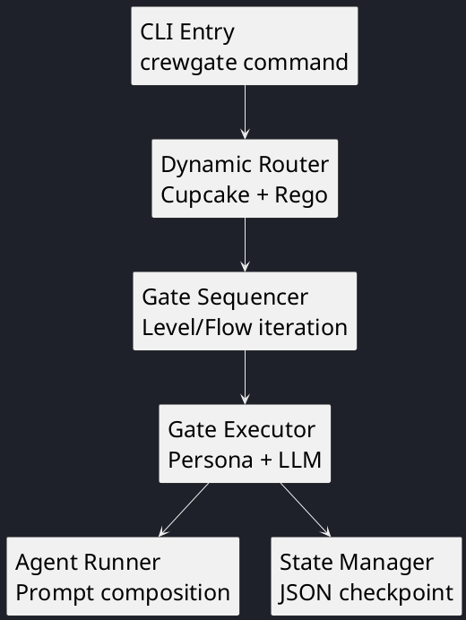

# C4 Component Runtime View

This document shows the major runtime components inside the CrewGate pipeline container for v0.1.

**Pipeline séquentiel** : chaque gate est exécutée dans l'ordre défini par le Dynamic Router. Le State Manager checkpoint après chaque gate.

**Composants v0.1** :

| Composant | Technologie | Dépendances externes |
|-----------|-------------|---------------------|
| CLI Entry | TypeScript + Bun | Aucune |
| Dynamic Router | TypeScript + Cupcake | Cupcake CLI (Rego/Wasm) |
| Gate Sequencer | TypeScript | Aucune |
| Gate Executor | TypeScript | OpenCode LLM (via adaptateur) |
| Agent Runner | TypeScript | Personas/ + Behaviors/ (disque) |
| State Manager | TypeScript | Filesystem (`.crewgate/state/`) |

## Code-Level Views

| Module | File |
|--------|------|
| Core domain entities + config | `code-domain.md` |
| Port interfaces | `code-ports.md` |
| Orchestrator, Router, Agent Runner | `code-orchestrator.md` |
| Adapter implementations | `code-adapters.md` |

---

| Author       | Last modified |
|-------------|-------------|
| Rémi Boivin | 2026-05-21 |