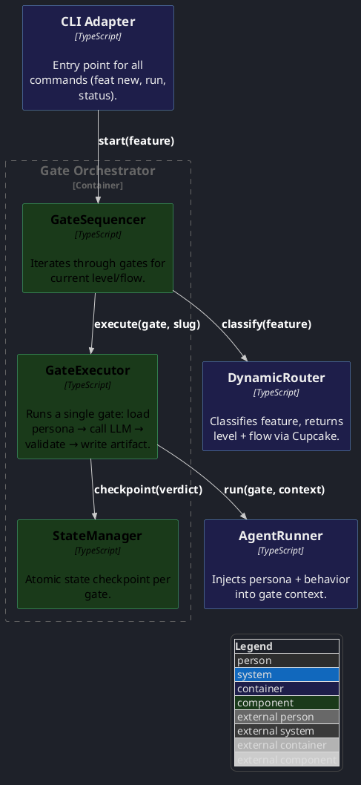

# C4 Component Diagram (Gate Orchestrator)

```plantuml
@startuml
!$ELEMENT_FONT_COLOR = "#EEEEEE"
!$ARROW_COLOR = "#CCCCCC"
!$ARROW_FONT_COLOR = "#FFFFFF"
!$BOUNDARY_COLOR = "#666666"
!$LEGEND_TITLE_COLOR = "#DDDDDD"
!$LEGEND_FONT_COLOR = "#DDDDDD"
!$LEGEND_BG_COLOR = "#2A2A2A"
!$LEGEND_BORDER_COLOR = "#444444"

!$PERSON_BG_COLOR = "#2D2D2D"
!$PERSON_BORDER_COLOR = "#555555"
!$CONTAINER_BG_COLOR = "#1E1E4A"
!$CONTAINER_BORDER_COLOR = "#6A9FD0"
!$COMPONENT_BG_COLOR = "#1A3A1A"
!$COMPONENT_BORDER_COLOR = "#4AC07F"
!$EXTERNAL_SYSTEM_BG_COLOR = "#3A3A3A"
!$EXTERNAL_SYSTEM_BORDER_COLOR = "#666666"

!include <C4/C4_Component>

skinparam backgroundColor #1e2129
skinparam defaultFontSize 15

LAYOUT_WITH_LEGEND()

Container(cli, "CLI Adapter", "TypeScript", "Entry point for all commands (feat new, run, status).")

Container_Boundary(orchestrator, "Gate Orchestrator") {
    Component(gate_seq, "GateSequencer", "TypeScript", "Iterates through gates for current level/flow.")
    Component(gate_exec, "GateExecutor", "TypeScript", "Runs a single gate: load persona → call LLM → validate → write artifact.")
    Component(state_mgr, "StateManager", "TypeScript", "Atomic state checkpoint per gate.")
}

Container(agent_runner, "AgentRunner", "TypeScript", "Injects persona + behavior into gate context.")
Container(router, "DynamicRouter", "TypeScript", "Classifies feature, returns level + flow via Cupcake.")

Rel(cli, gate_seq, "start(feature)")
Rel(gate_seq, gate_exec, "execute(gate, slug)")
Rel(gate_exec, state_mgr, "checkpoint(verdict)")
Rel(gate_exec, agent_runner, "run(gate, context)")
Rel(gate_seq, router, "classify(feature)")
@enduml
```

---

| Author      | Last modified |
|-------------|---------------|
| Rémi Boivin | 2026-05-21    ||