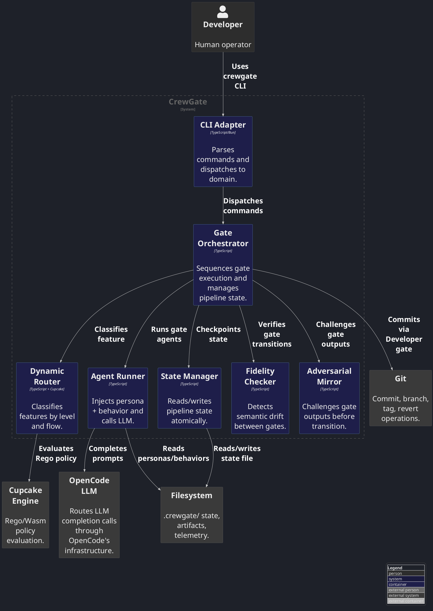

# C4 Container Diagram

```plantuml
@startuml
!$ELEMENT_FONT_COLOR = "#EEEEEE"
!$ARROW_COLOR = "#CCCCCC"
!$ARROW_FONT_COLOR = "#FFFFFF"
!$BOUNDARY_COLOR = "#666666"
!$LEGEND_TITLE_COLOR = "#DDDDDD"
!$LEGEND_FONT_COLOR = "#DDDDDD"
!$LEGEND_BG_COLOR = "#2A2A2A"
!$LEGEND_BORDER_COLOR = "#444444"

!$PERSON_BG_COLOR = "#2D2D2D"
!$PERSON_BORDER_COLOR = "#555555"
!$SYSTEM_BG_COLOR = "#1A1A3E"
!$SYSTEM_BORDER_COLOR = "#4A7FC0"
!$CONTAINER_BG_COLOR = "#1E1E4A"
!$CONTAINER_BORDER_COLOR = "#6A9FD0"
!$EXTERNAL_SYSTEM_BG_COLOR = "#3A3A3A"
!$EXTERNAL_SYSTEM_BORDER_COLOR = "#666666"

!include <C4/C4_Container>

skinparam backgroundColor #1e2129
skinparam defaultFontSize 25

LAYOUT_WITH_LEGEND()

Person(developer, "Developer", "Human operator")

System_Boundary(crewgate, "CrewGate") {
    Container(cli, "CLI Adapter", "TypeScript/Bun", "Parses commands and dispatches to domain.")
    Container(orchestrator, "Gate Orchestrator", "TypeScript", "Sequences gate execution and manages pipeline state.")
    Container(router, "Dynamic Router", "TypeScript + Cupcake", "Classifies features by level and flow.")
    Container(agent_runner, "Agent Runner", "TypeScript", "Injects persona + behavior and calls LLM.")
    Container(state_manager, "State Manager", "TypeScript", "Reads/writes pipeline state atomically.")
    Container(fidelity, "Fidelity Checker", "TypeScript", "Detects semantic drift between gates.")
    Container(adversary, "Adversarial Mirror", "TypeScript", "Challenges gate outputs before transition.")
}

System_Ext(opencode_llm, "OpenCode LLM", "Routes LLM completion calls through OpenCode's infrastructure.")
System_Ext(cupcake, "Cupcake Engine", "Rego/Wasm policy evaluation.")
System_Ext(fs, "Filesystem", ".crewgate/ state, artifacts, telemetry.")
System_Ext(git, "Git", "Commit, branch, tag, revert operations.")

Rel(developer, cli, "Uses crewgate CLI")
Rel(cli, orchestrator, "Dispatches commands")
Rel(orchestrator, router, "Classifies feature")
Rel(orchestrator, agent_runner, "Runs gate agents")
Rel(agent_runner, opencode_llm, "Completes prompts")
Rel(orchestrator, state_manager, "Checkpoints state")
Rel(orchestrator, fidelity, "Verifies gate transitions")
Rel(orchestrator, adversary, "Challenges gate outputs")
Rel(state_manager, fs, "Reads/writes state file")
Rel(agent_runner, fs, "Reads personas/behaviors")
Rel(orchestrator, git, "Commits via Developer gate")
Rel(router, cupcake, "Evaluates Rego policy")
@enduml
```

---

| Author      | Last modified |
|-------------|---------------|
| Rémi Boivin | 2026-05-21    ||