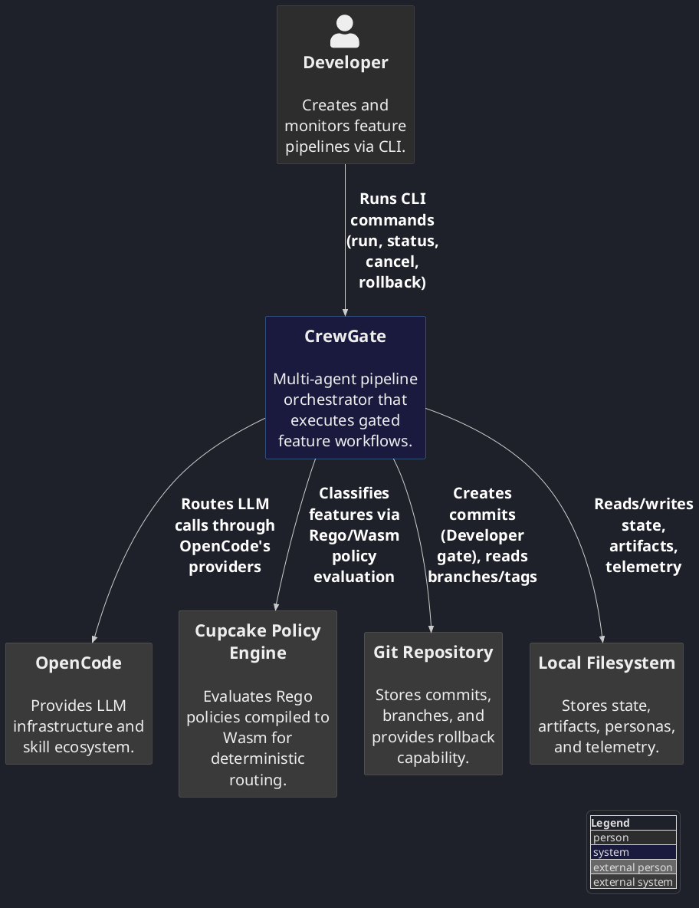

# C4 System Context Diagram

```plantuml
@startuml
!$ELEMENT_FONT_COLOR = "#EEEEEE"
!$ARROW_COLOR = "#CCCCCC"
!$ARROW_FONT_COLOR = "#FFFFFF"
!$BOUNDARY_COLOR = "#666666"
!$LEGEND_TITLE_COLOR = "#DDDDDD"
!$LEGEND_FONT_COLOR = "#DDDDDD"
!$LEGEND_BG_COLOR = "#2A2A2A"
!$LEGEND_BORDER_COLOR = "#444444"

!$PERSON_BG_COLOR = "#2D2D2D"
!$PERSON_BORDER_COLOR = "#555555"
!$SYSTEM_BG_COLOR = "#1A1A3E"
!$SYSTEM_BORDER_COLOR = "#4A7FC0"
!$EXTERNAL_SYSTEM_BG_COLOR = "#3A3A3A"
!$EXTERNAL_SYSTEM_BORDER_COLOR = "#666666"

!include <C4/C4_Context>

skinparam backgroundColor #1e2129
skinparam defaultFontSize 20

LAYOUT_WITH_LEGEND()

Person(developer, "Developer", "Creates and monitors feature pipelines via CLI.")
System(crewgate, "CrewGate", "Multi-agent pipeline orchestrator that executes gated feature workflows.")

System_Ext(opencode, "OpenCode", "Provides LLM infrastructure and skill ecosystem.")
System_Ext(cupcake, "Cupcake Policy Engine", "Evaluates Rego policies compiled to Wasm for deterministic routing.")
System_Ext(git, "Git Repository", "Stores commits, branches, and provides rollback capability.")
System_Ext(filesystem, "Local Filesystem", "Stores state, artifacts, personas, and telemetry.")

Rel(developer, crewgate, "Runs CLI commands (run, status, cancel, rollback)")
Rel(crewgate, opencode, "Routes LLM calls through OpenCode's providers")
Rel(crewgate, cupcake, "Classifies features via Rego/Wasm policy evaluation")
Rel(crewgate, git, "Creates commits (Developer gate), reads branches/tags")
Rel(crewgate, filesystem, "Reads/writes state, artifacts, telemetry")
@enduml
```

---

| Author      | Last modified |
|-------------|---------------|
| Rémi Boivin | 2026-05-21    ||