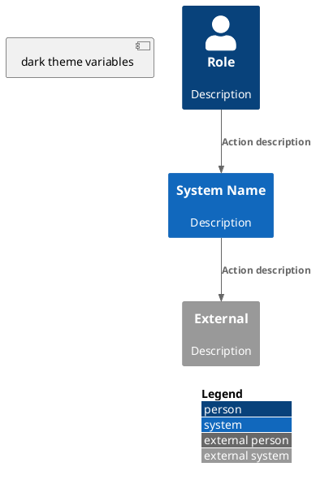
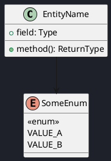

# Documentation Rules

Rules for maintaining the project documentation site. CrewGate uses MkDocs with the Material theme, hosted as a static site.

---

## Stack

| Tool | Purpose |
|------|---------|
| MkDocs | Static site generator |
| Material for MkDocs | Theme |
| MkDocs plugins | Search, navigation, macros |
| Mermaid | Sequence/flow/architecture diagrams |
| PlantUML | C4 model diagrams (architecture only) |
| TypeDoc | API reference documentation (generated) |

Build command: `mkdocs build --strict`

---

## Structure

```
docs/
├── index.md                 # Root entry point
├── architecture/            # System design
│   ├── index.md
│   ├── assumptions.md
│   ├── system-boundaries.md
│   └── c4/                  # C4 model diagrams
│       ├── index.md
│       ├── system-context.md
│       ├── containers.md
│       ├── components.md
│       └── code.md
├── engineering/             # Developer-facing docs
│   ├── index.md
│   ├── standards.md
│   ├── newcomer_guide.md
│   ├── artifact_provenance.md
│   ├── external_project_usage.md
│   ├── user-guide/          # User-facing docs
│   │   ├── index.md
│   │   ├── installation.md
│   │   ├── quickstart.md
│   │   ├── cli.md
│   │   ├── pipeline.md
│   │   ├── personas.md
│   │   ├── behaviors.md
│   │   ├── routing.md
│   │   └── configuration.md
│   └── tooling/             # Tool configuration
│       ├── index.md
│       ├── documentation-rules.md  (this file)
│       ├── monitoring.md
│       └── testing/
│           ├── unitest.md
│           └── e2e_tests.md
└── governance/              # Rules and ADRs
    ├── index.md
    ├── constitution.md
    ├── quickstart.md
    ├── levels.md
    ├── workflows.md
    ├── authority-map.md
    ├── contribution-model.md
    ├── checklists/
    │   ├── before-coding.md
    │   └── before-merge.md
    └── adr/├──
        ├── index.md
        └── _template.md
```

---

## Index Page Rule

Every section with child pages must have an `index.md` that shows **content summaries** of each referenced file, not just a file listing.

Good:
```
### [file.md](file.md)

Core concepts:
- Main topic 1 with short explanation
- Main topic 2 with short explanation
```

Bad:
```
- file.md
```

---

## Navigation

- All `index.md` files must be listed in `mkdocs.yml` nav section.
- Leaf pages (non-index) may be excluded from nav if they are reference content reached only from index links.
- The nav structure mirrors the `docs/` directory structure.
- New sections must be added to the nav when created.

---

## Diagram Conventions

### Mermaid

- Use Mermaid for flowcharts, sequence diagrams, and state diagrams.
- Mermaid blocks use standard fenced code syntax:
  ```mermaid
  graph LR; A-->B
  ```
- Keep diagrams simple — one diagram per concept.
- Prefer horizontal flow over vertical to avoid scrolling.

### PlantUML / C4

CrewGate uses the **C4 model** for architecture diagrams via PlantUML. All C4 diagrams live inline in Markdown files under `docs/architecture/c4/`. There are no separate `.puml` files — source is the `.md` file.

#### C4 Hierarchy

| Level | What it shows | PlantUML include | File pattern |
|-------|---------------|------------------|--------------|
| **Context** | System as black box, users, external dependencies | `!include <C4/C4_Context>` | `docs/architecture/c4/context.md` |
| **Container** | Internal high-level modules and their relationships | `!include <C4/C4_Container>` | `docs/architecture/c4/container.md` |
| **Component** | Module internals (one module per diagram) | `!include <C4/C4_Component>` | `docs/architecture/c4/component.md` |
| **Code** | Class-level entities, interfaces, relationships | PlantUML class diagram (no C4 include) | `docs/architecture/c4/code-*.md` |

Keep one level per file. Do not mix context and container elements in the same diagram.

#### What Each Level Must Document

| Level | Must show | Must include | Avoid |
|-------|-----------|-------------|-------|
| **Context** | Users (roles), the system as a black box, every external dependency it talks to | All external systems (LLM, Cupcake, Git, filesystem), data flow direction, protocol boundary | Internal modules, class names, implementation details |
| **Container** | High-level deployable units inside the system, their responsibilities, tech stack | Every container with a name + technology + one-line responsibility, all inter-container relationships, external dependencies again (context boundary) | Internal classes, database schemas, method signatures |
| **Component** | Internal structure of one container — its significant modules and their relationships | Major components inside the chosen container, their public responsibilities, how they call each other | External dependencies (they go in Container), class fields, private methods |
| **Code** | Key domain entities, port interfaces, adapter implementations | Classes with relevant fields and methods, relationships (inheritance, composition, dependency), stereotypes for enums and interfaces | Every single method on every class — only the entry points and key relationships |

**Rule of thumb:** If a detail would belong in a lower C4 level, it does not belong in this one. A Context diagram should not mention classes. A Container diagram should not show method signatures.

#### Dark Theme (Mandatory)

All diagrams must use the dark theme palette to match the MkDocs Material slate scheme:

```plantuml
!$ELEMENT_FONT_COLOR = "#EEEEEE"
!$ARROW_COLOR = "#CCCCCC"
!$ARROW_FONT_COLOR = "#FFFFFF"
!$BOUNDARY_COLOR = "#666666"
!$LEGEND_TITLE_COLOR = "#DDDDDD"
!$LEGEND_FONT_COLOR = "#DDDDDD"
!$LEGEND_BG_COLOR = "#2A2A2A"
!$LEGEND_BORDER_COLOR = "#444444"

!$PERSON_BG_COLOR = "#2D2D2D"
!$PERSON_BORDER_COLOR = "#555555"
!$SYSTEM_BG_COLOR = "#1A1A3E"
!$SYSTEM_BORDER_COLOR = "#4A7FC0"
!$CONTAINER_BG_COLOR = "#1E1E4A"
!$CONTAINER_BORDER_COLOR = "#6A9FD0"
!$COMPONENT_BG_COLOR = "#222255"
!$COMPONENT_BORDER_COLOR = "#8888CC"
!$EXTERNAL_SYSTEM_BG_COLOR = "#3A3A3A"
!$EXTERNAL_SYSTEM_BORDER_COLOR = "#666666"

skinparam backgroundColor #1e2129
skinparam defaultFontSize 20
```

For code-level class diagrams (no C4 include), use at minimum:

```plantuml- `docs/engineering/standards.md` — Coding and documentation conventions
- `docs/engineering/tooling/build.md` — Build toolchain

skinparam backgroundColor #1e2129
skinparam defaultFontSize 25
skinparam arrowFontSize 20
skinparam arrowFontColor #DDDDDD
skinparam arrowColor #EEEEEE
```

#### Styling Rules

| Rule | Description |
|------|-------------|
| **One diagram per file** | No exceptions. If a page needs two views, split into two pages. |
| **LAYOUT_WITH_LEGEND()** | Mandatory for Context and Container diagrams. Optional for Component. |
| **No separate .puml files** | Source lives inline in the `.md` file. This keeps docs self-contained. |
| **Element descriptions** | Every `Person()`, `System()`, `Container()`, `Component()` must have a short description as the third argument — "Human operator" is not enough. Explain the role. |
| **Relationship labels** | Every `Rel()` must describe the data or control flow. Prefer verb phrases: "Sends classified feature to", "Reads/writes state from". |
| **No crossing lines** | Arrange elements to minimize line crossings. Use `LAYOUT_LEFT_RIGHT()` or `LAYOUT_TOP_DOWN()` when needed. |
| **Skinparam font sizes** | Context: 20, Container: 25, Component: 22, Code: 25. This keeps text readable at different zoom levels. |

#### Code-Level Class Diagrams

For code-level views (class diagrams without C4 includes):

- Use PlantUML class diagram syntax only — no `!include <C4/C4_*>`
- Define classes with fields and methods
- Show relationships with `-->`, `..>`, `--|>` as appropriate
- Annotate enums with `<<enum>>` stereotype
- Group related entities with `package` or `namespace` blocks
- Keep class diagrams focused on one module or concern — do not include every entity in a single diagram

#### When to Update C4 Diagrams

| Trigger | Action |
|---------|--------|
| New module or package boundary | Add or update Container / Component level |
| New port interface | Update code-ports.md |
| New adapter implementation | Update code-adapters.md |
| New domain entity | Update code-domain.md |
| Pipeline gate sequence changes | Update component-runtime.md |
| External dependency added or removed | Update context.md and container.md |

C4 diagrams must be reviewed as part of any `$architect` gate. ADRs affecting architecture must reference the relevant C4 pages.

#### Example: Context Diagram



#### Example: Class Diagram



---

## Writing Style

- **English only.** No exceptions.
- **Active voice.** "The orchestrator runs the pipeline" not "The pipeline is run by the orchestrator".
- **Present tense.** Describe the system as it is designed.
- **No fluff.** Every sentence must earn its place. Remove filler like "It is worth noting that", "Please note", "In order to".
- **Tables** for structured comparisons and reference data.
- **Bullet lists** for non-ordered items. Never nest beyond two levels.
- **Code blocks** with language tags for commands, config, and code.

---

## Conventions per File Type

| File | Language tag | Notes |
|------|-------------|-------|
| Shell commands | `bash` | Full commands, no placeholders |
| Config / YAML | `yaml` | Must be valid YAML |
| TypeScript | `typescript` | Only relevant snippets |
| PlantUML | `puml` | Source, not rendered output |
| Mermaid | `mermaid` | Rendered by MkDocs plugin |

---

## Review Process

Documentation changes follow the same governance as code changes:

- **L1 (doc-only fix):** Fix typos, clarify wording. No architect gate needed.
- **L2 (standard doc change):** Add new page, update existing content. Requires `$doc` gate.
- **L3 (structural doc change):** Restructure docs directory, change nav, add/remove sections. Requires `$architect` gate and `$doc`.

Every doc PR must pass `mkdocs build --strict`.

---

## Maintenance Rules

| Rule | Description |
|------|-------------|
| **Strict build** | `mkdocs build --strict` must pass before merge |
| **No dead links** | All internal links must resolve. Check with `mkdocs build --strict` |
| **Index pages** | Every section needs an `index.md` with content summaries |
| **Diagram review** | Diagrams must be reviewed when the architecture they represent changes |
| **ADR sync** | Architecture pages must reflect current ADR decisions |
| **File naming** | kebab-case for doc files, lowercase with hyphens |
| **Footer** | Every page ends with `Author` and `Last modified` |

---

## Related

- `mkdocs.yml` — MkDocs site configuration

---

| Author      | Last modified |
|-------------|---------------|
| Rémi Boivin | 2026-05-22    |
